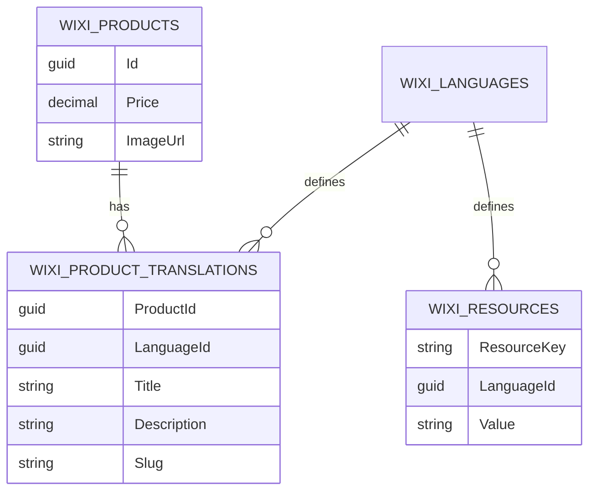

# Multi-Language & Localization Architecture (Deep Dive)

Bu doküman, Wixi platformunda hem dinamik verilerin (Ürün, Menü, Kategori) hem de statik UI metinlerinin çok dilli yönetim mimarisini açıklar.

---

## 📌 1. Mimarinin Temel Katmanları

Sistem, dil desteğini üç ana seviyede ele alır:

### A. Dil Yönetimi (`WIXI_LANGUAGES`)
Sistemin desteklediği tüm diller bu tabloda tanımlanır.
- `Id` (Guid/Int)
- `Code` (örn: "tr-TR", "en-US", "de-DE")
- `Name` (örn: "Türkçe", "English")
- `IsDefault` (Boolean) - Çeviri bulunamadığında dönülecek ana dil.
- `IsActive` (Boolean)

### B. Statik UI/Resource Lokalizasyonu (`WIXI_RESOURCES`)
Butonlar, hata mesajları ve Sidebar menü başlıkları gibi "kod içinde sabit" kalması istenmeyen metinler burada tutulur.
- `ResourceKey` (String) - örn: `SIDEBAR_DASHBOARD`, `AUTH_LOGIN_SUCCESS`
- `Value` (String) - örn: "Gösterge Paneli"
- `LanguageId` (FK)

### C. Dinamik Veri Lokalizasyonu (Parent-Translation Model)
Veritabanındaki ana kayıtların (Ürün, Blok vb.) dil bağımlı alanlarını yönetmek için kullanılır.

**Örnek: Ürün Tablosu Yapısı**
- **Ana Tablo (`WIXI_PRODUCTS`):** Dil bağımsız alanlar (`Id`, `Price`, `Stock`, `Image`, `CreatedAt`)
- **Çeviri Tablosu (`WIXI_PRODUCT_TRANSLATIONS`):** Dil bağımlı alanlar (`ProductId`, `LanguageId`, `Title`, `Description`, `Slug`)

---

## 📌 2. Dinamik Sidebar Menü Entegrasyonu

Sidebar menülerinin çok dilli olması için `WIXI_RESOURCES` tablosu ile ilişki kurulur.

| MenuKey | Icon | SortOrder | TargetPath |
| :--- | :--- | :--- | :--- |
| `MENU_SYSTEM_LOGS` | `FaListAlt` | 10 | `/admin/logs` |

**Resources Tablosu Karşılığı:**
- `MENU_SYSTEM_LOGS` | "tr-TR" | "Sistem Logları"
- `MENU_SYSTEM_LOGS` | "en-US" | "System Logs"

---

## 📌 3. Teknik Uygulama ve Performans

### Backend (ASP.NET Core / EF Core)
1. **Language Detection:** İstek geldiğinde `Accept-Language` header'ı okunarak `Thread.CurrentUICulture` otomatik set edilir.
2. **Global Query Filters:** EF Core tarafında, sorgularda o anki aktif dile ait çeviri tablosu otomatik olarak `Include` edilip `Select` edilir.
3. **Caching Layer (Kritik):** Çeviriler çok sık değişmediği için `In-Memory Cache` veya `Redis` üzerinde tutulur. Her sayfa yenilemede veritabanına Join atılmaz.

### Frontend (React / i18next)
1. **i18next-http-backend:** Frontend açıldığında, aktif dilin resource paketini (WIXI_RESOURCES) API'den tek seferde çeker.
2. **Translaton Hook:** UI içinde `t('SIDEBAR_DASHBOARD')` şeklinde kullanılır.

---

## 📌 4. Fallback (Geri Dönüş) Stratejisi

Eğer bir kaydın talep edilen dilde (örn: Almanca) çevirisi yoksa:
1. Sistem önce `WIXI_LANGUAGES` tablosundaki `IsDefault=true` olan dili arar.
2. Eğer o da yoksa, ana tablodaki ham veriyi (veya boş string) döner.
3. Bu sayede arayüzde eksik metin (null) görünmesi engellenir.

---

## 📌 5. ERD Görselleştirme (Taslak)

